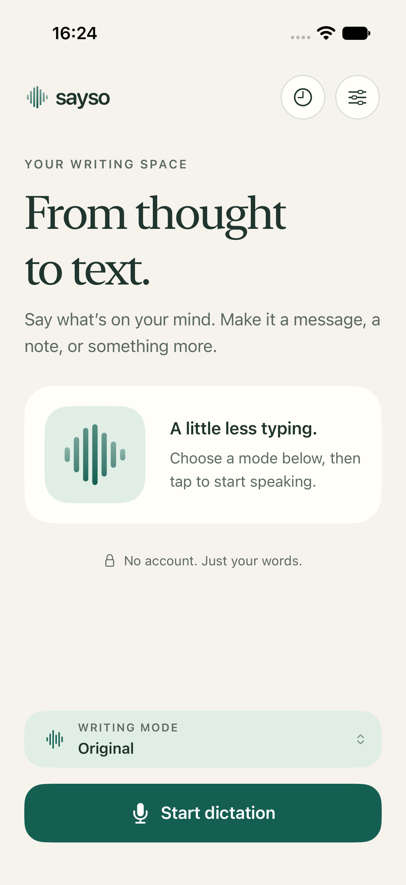
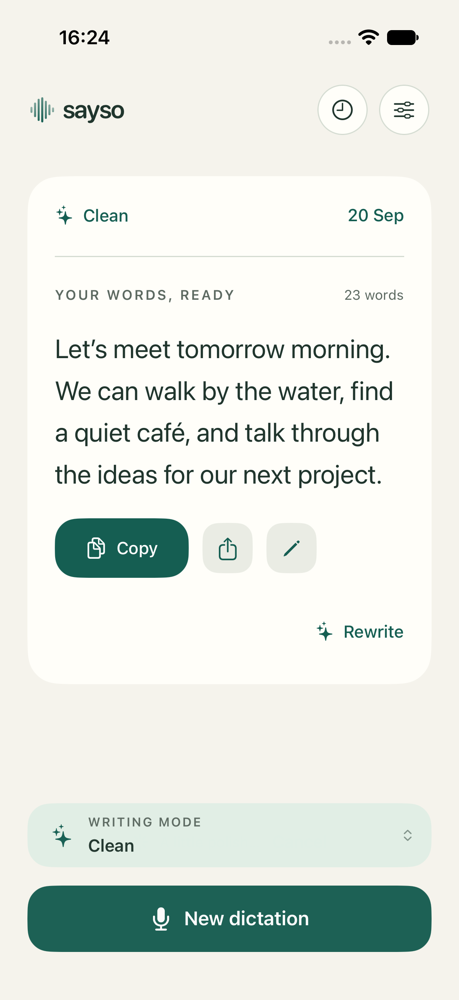
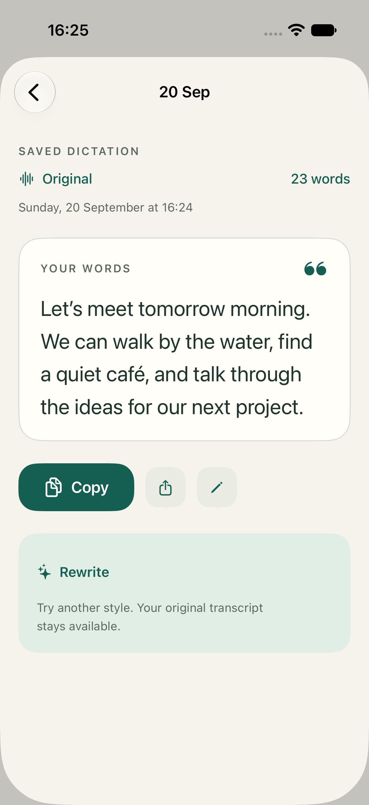

# Sayso

A simple iPhone app that turns your voice into text. Speak, review what you said, optionally have it rewritten as a message, email or note, then copy or share it.

Everything runs on your iPhone. There's no account, no API key and no server.

  
  
  

## Features

- **Live transcription** with Apple's on-device speech recognition. You see your words as you speak.
- **Parakeet (optional).** A downloadable speech model that works fully offline and detects 25 European languages automatically. See [Using Parakeet](docs/PARAKEET.md).
- **Writing modes.** Keep your words exactly as spoken (**Original**), or have Apple Intelligence turn them into **Clean**, **Message**, **Email** or **Notes** text. You can edit any prompt or create your own modes. See [Writing modes](docs/WRITING_MODES.md).
- **Your original is always kept.** If a rewrite fails or isn't what you wanted, switch back to what you actually said.
- **History.** Saved dictations are grouped by day, searchable and editable. You can turn history off.
- **Vocabulary.** Add names and terms so they're spelled correctly.
- **Shortcut.** A "Start Dictation" action for Siri, Shortcuts or the Action button.
- A calm paper-and-teal design, with native Liquid Glass toolbar buttons. Light and dark mode, landscape, large text sizes, VoiceOver and Reduce Motion are all supported.

## Requirements

- An iPhone running **iOS 27** or later.
- **Apple Intelligence** for rewriting. Original mode works without it.
- Internet access the first time you use a language or download Parakeet. After that, recording works offline.

## Privacy

- Audio and text are never sent to a server.
- Recordings are not saved. Only the resulting text is kept, and only if history is on.
- History is stored on your iPhone and may be included in your device backups.

## Build and run

1. Open `Sayso.xcodeproj` in **Xcode 27** or later.
2. Select the **Sayso** scheme and an iOS 27 simulator or your iPhone.
3. Press **Run**.

To run on a real iPhone, pick your own team under **Signing & Capabilities**, and change the bundle identifier (`solimanali.Sayso`) to one you own.

Swift packages (FluidAudio, used for Parakeet) are fetched automatically by Xcode.

For tests and developer tools, see [Development](docs/DEVELOPMENT.md).

## Guides

- [Writing modes](docs/WRITING_MODES.md): the built-in modes, editing prompts and making your own
- [Using Parakeet](docs/PARAKEET.md): setting up the offline speech model
- [Development](docs/DEVELOPMENT.md): tests, developer tools and a real-iPhone checklist
- [Design](docs/DESIGN.md): colors, layout and design guidelines

## Project layout

| Folder | Contents |
| --- | --- |
| `Sayso/` | The app |
| `SaysoTests/` | Unit tests |
| `SaysoUITests/` | UI tests |
| `scripts/` | Test runner and developer tools |
| `docs/` | Guides and screenshots |

## Limitations

- Rewrites can occasionally drop or change details. Check important text, such as names, numbers and dates, before sending it.
- Recording stops when you leave the app. Keep Sayso open while you speak.
- Parakeet shows text after you stop, not live, and recordings are limited to 10 minutes.

## Acknowledgements

- [Parakeet TDT v3](https://huggingface.co/FluidInference/parakeet-tdt-0.6b-v3-coreml) by NVIDIA, converted for Apple devices by Fluid Inference.
- [FluidAudio](https://github.com/FluidInference/FluidAudio) by Fluid Inference, which runs Parakeet on the device.

## License

Sayso is released under the [MIT License](LICENSE). Parakeet and FluidAudio have their own licenses; see [Using Parakeet](docs/PARAKEET.md#credits-and-licenses).
