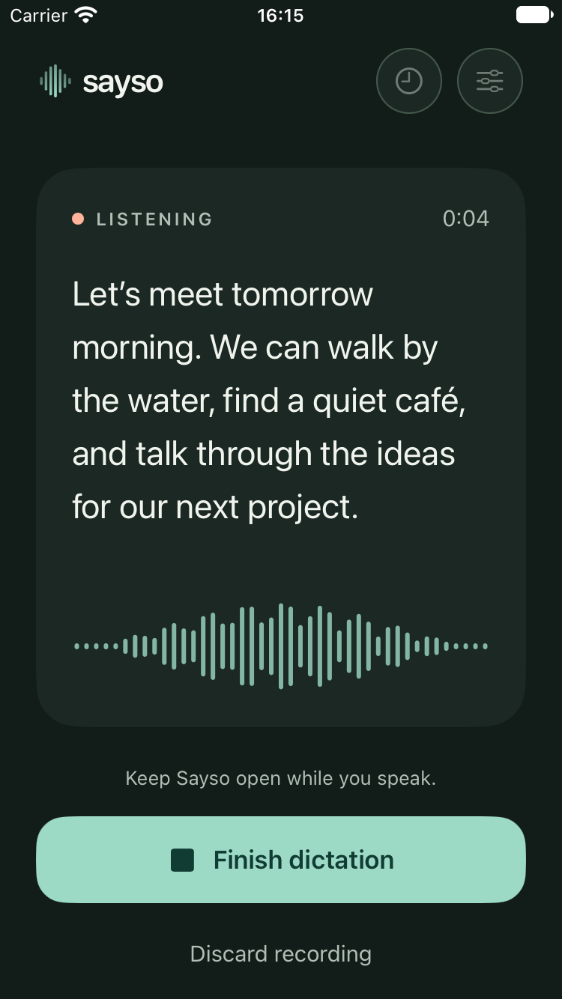
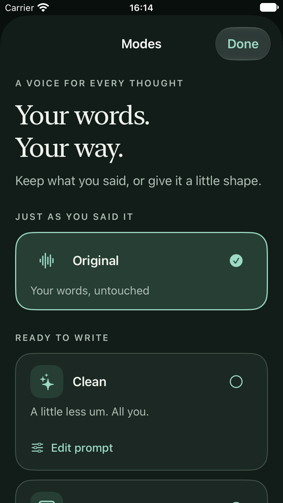

# Design

Sayso should feel like a calm place to write: warm paper surfaces, a deep teal accent and very little decoration. Toolbar and navigation buttons use native iOS Liquid Glass. Text sits on solid cards so it stays easy to read.

  
  

## Screens

1. **Home:** a short introduction, your latest dictation (once you have one), the writing mode picker and a single Start dictation button.
2. **Recording:** your words as you speak, a live input level, a timer, and buttons to finish or discard.
3. **Result:** your text on a paper-like card, with Copy, Share, Edit and Rewrite. You can switch between the original and the rewritten version.
4. **History:** saved dictations grouped by day, with search. Deleting always asks first.
5. **Modes:** Original, the built-in rewrite modes and your own modes, each with its own prompt editor.
6. **Settings:** speech model, language, vocabulary, rewriting, history and the shortcut.

## Colors

| Name | Light | Dark | Used for |
| --- | --- | --- | --- |
| canvas | `#F5F3EC` | `#121C19` | Background |
| paper | `#FFFEF9` | `#1B2823` | Text cards and grouped content |
| surface | `#EAECE4` | `#24312C` | Secondary buttons |
| accentSoft | `#E0EEE5` | `#263E33` | Selected mode, soft highlights |
| accent | `#155E52` | `#9DDAC6` | Buttons and selection |
| onAccent | `#FFFFFF` | `#103C33` | Text on accent buttons |
| ink | `#20352D` | `#F0F4ED` | Main text |
| secondaryInk | `#5C6961` | `#B0BFB5` | Supporting text |
| hairline | `#D4DBD1` | `#46594E` | Dividers |
| recording | `#A33E27` | `#FFB49B` | Recording indicator (always paired with a text label) |

These live in `Sayso/Views/SaysoTheme.swift`. All text colors are easy to read against their backgrounds (at least 4.5:1 contrast) in both light and dark mode.

## Guidelines

- **Type:** system fonts and SF Symbols. A serif is used only for large introduction headings.
- **Text size:** everything scales with the system text size, with no upper limit. At the largest sizes your writing and input fields come first and extra details move below.
- **Spacing:** 24-point side margins. Text lines are kept to a comfortable width on larger screens.
- **Shapes:** cards have 24–28-point rounded corners and buttons have 20-point corners. No heavy shadows or gradients.
- **Touch targets:** at least 44 × 44 points. Icon-only buttons have VoiceOver labels. Selected items show a checkmark, not only a color change.
- **Layout:** the record button sits within easy thumb reach in portrait. Landscape uses a compact row of controls.
- **Motion:** animation only marks a change, like a new state or new text appearing. Nothing loops for decoration. With Reduce Motion on, sliding transitions and the moving level meter are turned off.

## App icon

Seven rounded bars forming a voice waveform, in the accent teal on the canvas color. See [Development](DEVELOPMENT.md#app-icon) for how the icon files are made.
